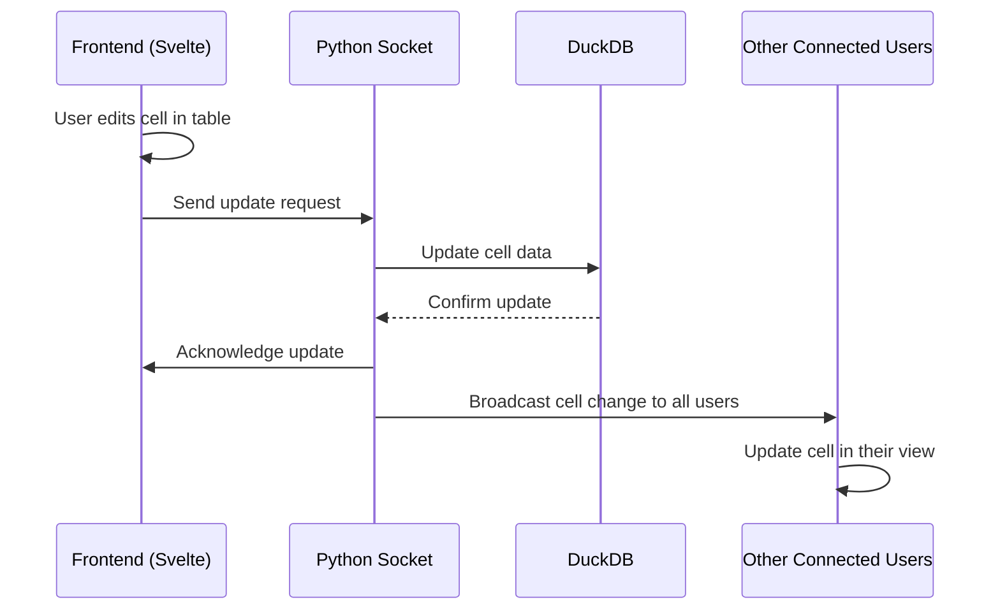

# svelte-socket-duckdb
Demonstration of socket implementation in python and duckdb to update the excel sheet in realtime.

```mermaid
sequenceDiagram
    participant F as Frontend (Svelte)
    participant S as Python Socket
    participant D as DuckDB
    participant O as Other Connected Users

    F->>F: User edits cell in table
    F->>S: Send update request
    S->>D: Update cell data
    D-->>S: Confirm update
    S->>F: Acknowledge update
    S->>O: Broadcast cell change to all users
    O->>O: Update cell in their view
```